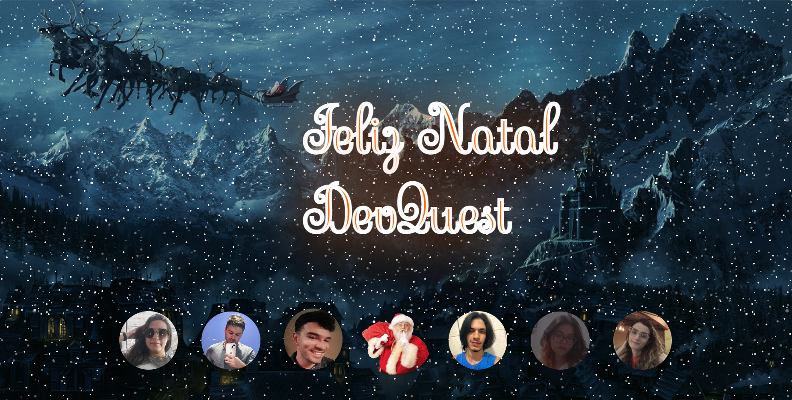

# Projeto de Natal - DevQuest

## Tabela de Conteúdo
<ul>
<li><a href="#sobre">Sobre</a></li>
<li><a href="#status">Objetivo</a></li>
<li><a href="#objetivo">Tecnologias</a></li>
<li><a href="#resultado">Resultado</a></li>
</ul>

## Sobre
Este projeto foi criado em conjunto com os alunos do curso DevQuest como forma de homenagem aos gêmeos (criadores) do curso.

## Objetivo

O desafio proposto era criar um design de natal, e uma mensagem escrita por cada participante do projeto. Na parte inferior da página, foram criados botões referentes ás mensagens de cada aluno participante, sendo possível navegar entre as mensagens ao clicar em cada botão. Também foram adicionados animações que deram uma incrível vibe de natal ao projeto.

## Tecnologias

* HTML
* CSS
* JAVASCRIPT

## Resultado

